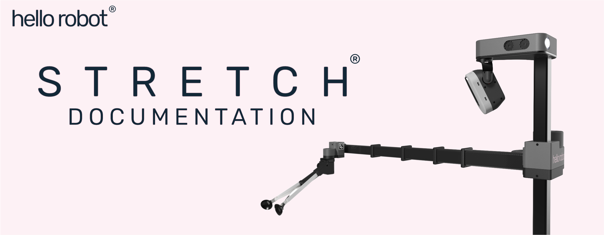

# Welcome
This is your jumping off point for Stretch tutorials, datasheets, APIs, and user guides. 

We wish you success in our development journey with Stretch. Please contact us at [support@hello-robot.com](mailto:support@hello-robot.com) if you don't find what you're looking for.

Best, 

The Hello Robot team

# New to Stretch?
We recommend you follow the [Stretch Getting Started Tutorials](). 

Please take the time to learn safe and best practices in operating Stretch.  

**The Stretch RE1 is a potentially dangerous robot. All users must carefully read the [Stretch Safety Guide](robot_safety_guide.md) prior to using the robot.**
# Where to Find Things 
All of the documentation is accessible and searchable via the navigation menu on this site. Alternatively, you can find the Markdown hosted on at the [Hello Robot GitHub portal](github.com/hello-robot).

In addition, it is worth spending some time on the following sites:

| Resource                                                                | Description                                                  |
|-------------------------------------------------------------------------|--------------------------------------------------------------|
| [Stretch Community](dex_wrist_user_guide.md)                            | Repository for community shared code                         |
| [Stretch Forum](battery_maintenance_guide.md)                           | Discourse User Forum                                         |

# Version
This is version 0.2 of the Stretch User Documentation. It is written with the following system configuration in mind:

| Resource                 | Description                  |
|--------------------------|------------------------------|
| Model                    | Stretch RE1 or Stretch RE1.5 |
| OS                       | Ubuntu 18.04 or 20.04        |
| ROS | Melodic or Noetic            |
| Stretch Body| >=0.3                        |
| Python                   | Python3                 |

You can access prior documentation suitable for older configurations [here]()

# License

This documentation is only to be used for an authentic Stretch RE1 robot produced and sold by Hello Robot Inc. 

All Hello Robot [stretch_docs](https://github.com/hello-robot/stretch_docs) related materials are released under the [Creative Commons Attribution-NoDerivatives 4.0 International (CC BY-ND 4.0)](https://creativecommons.org/licenses/by-nd/4.0) license.

The Stretch RE1 has patents pending.

