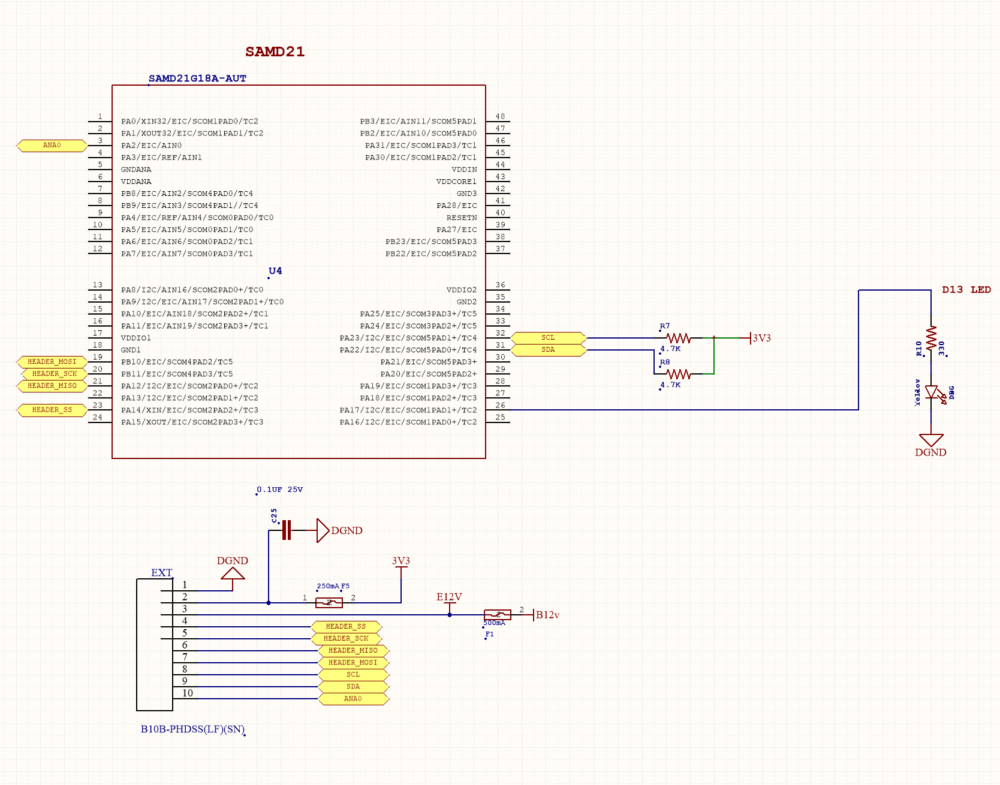

# Extending Stretch with Additional Hardware

This tutorial will walk you through different ways you can add additional hardware and integrate them with Stretch.

## Mounting your Hardware

Stretch provides various threaded mounting points (M4 threaded) around it's body where you could mount your hardware securely.

|   Base	|   Head	|   Shoulder	|   Wrist Tool Plate	|
|---	    |---	    |---	        |---	                |
|   {: style="height:700px,width:700px"}	|   {: style="height:700px,width:700px"}	|   {: style="height:700px,width:700px"}	|   {: style="height:700px,width:700px"}	|

## Powering your Hardware

Stretch providess additional 12V auxilary power ports on the base, head and shoulder  which you could use to power your additional hardware.

|   Base	|   Head	|   Shoulder	| 
|---	    |---	    |---	        |
|    	    |   	    |   	        |

Checkout **[Adding Jetson to Stretch](https://github.com/hello-robot/stretch_tool_share/tree/master/tool_share/jetson_orin_agx_mount)** tutorial which utilizes Stretch's mounting holes and auxilary power ports.

## Integrating Actuators and sensors

The robot's Wrist has different types of interfaces provided through which you could integrate additional actuators and sensors.

#### Wrist Dynamixel Interface

The wrist yaw degree-of-freedom uses a [Dynamixel XL430 servo](http://www.robotis.us/dynamixel-xl430-w250-t/). Additional Dynamixel servos can be **daisy chained off of this servo**, allowing for more additional motors.
Stretch comes with a XL430 compatible control cable preinstalled into this servo which can be used to daisy chain more XL430 compatible motors. If a different cable needs to be installed the servo cap can be removed as shown. 

{: style="height:250"}

Checkout **[Custom DOF](./custom_dof.md)** tutorial to learn how to integrate custom or additional Dynamixel joints and tool chains with Stretch Body.

#### Wrist Expansion USB

The wrist includes a USB 2.0 A interface. This power to this USB port is fused to 500mA@5V.

#### Wrist Expansion Header

The wrist includes an expansion header that provides access to pins of the wrist Arduino board.  The header connector can be accessed by removing the cap at the end of the arm.

The header is wired to a Atmel SAMD21G18A-AUT ([datasheet](http://ww1.microchip.com/downloads/en/DeviceDoc/SAM_D21_DA1_Family_DataSheet_DS40001882F.pdf)) microcontroller (same as Arduino Zero). The expansion header pins are configured at the factory to allow:

* General purpose digital I/O
* Analog input

In addition, the firmware can be configured for other pin functions, including:

* Serial SPI
* Serial I2C
* Serial UART

Checkout **[Wrist Expansion Header](./wrist_expansion_header.md)** tutorial to learn how to write custom Wacc firmware to utilize the above pin functions to read sensor data and integrate it with Stretch Body.

**The header pins utilize 3V3 TTL logic. They have limited interface protection (eg, ESD, over-voltage, shorts). It is possible to damage your robot if pin specifications are exceeded **

The pin mapping is:

<table>
  <tr>
    <td>Pin</td>
    <td>Name</td>
    <td>Function</td>
      <td>Factory Firmware</td>
  </tr>
  <tr>
    <td>1</td>
    <td>DGND</td>
    <td>Digital ground</td>
      <td></td>
  </tr>
  <tr>
    <td>2</td>
    <td>3V3</td>
    <td>3.3V supply fused at 250mA.</td>
      <td></td>
  </tr>
    <tr>
    <td>3</td>
    <td>E12V</td>
    <td>12VDC fused at 500mA</td>
        <td></td>
  </tr>
  <tr>
    <td>4</td>
    <td>SS</td>
    <td>DIO | SPI SS </td>
      <td>Digital out (D3)</td>
  </tr>
    <tr>
    <td>5</td>
    <td>SCK</td>
    <td>DIO | SPI SCK</td>
        <td>Digital out (D2)</td>
  </tr>
    <tr>
    <td>6</td>
    <td>MISO</td>
    <td>DIO | SPI MISO |UART TX</td>
        <td>Digital in (D0)</td>
  </tr>
    <tr>
    <td>7</td>
    <td>MOSI</td>
    <td>DIO | SPI MOSI | UART RX</td>
        <td>Digital in (D1)</td>
  </tr>
    <tr>
    <td>8</td>
    <td>SCL</td>
    <td>DIO | I2C SCL</td>
        <td>Not used</td>
  </tr>
    <tr>
    <td>9</td>
    <td>SS</td>
    <td>DIO | I2C SDA</td>
        <td>Not used</td>
  </tr>
    <tr>
    <td>10</td>
    <td>ANA0</td>
    <td>Analog input </td>
        <td>Analog in (A0)</td>
</table>

The expansion DIO uses a 10 pin JST header [B10B-PHDSS(LF)(SN)](https://www.digikey.com/product-detail/en/jst-sales-america-inc/B10B-PHDSS-LF-SN/455-1762-ND/926668).  It is compatible with a [JST PHDR-10VS](https://www.digikey.com/product-detail/en/jst-sales-america-inc/PHDR-10VS/455-1158-ND/608600) housing. JST provides pre-crimped wire compatible with this housing ( part [APAPA22K305](https://www.digikey.com/product-detail/en/jst-sales-america-inc/APAPA22K305/455-3086-ND/6009462)).

Pin 1 & 10 are indicated below.

The expansion DIO schematic shown below.

