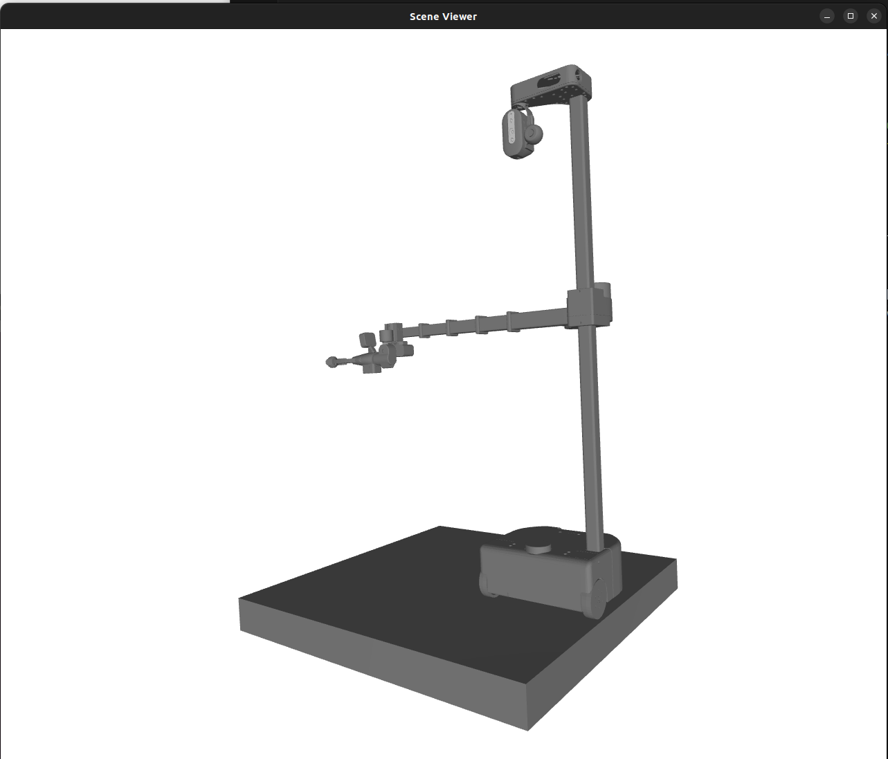

# URDF Management
This tutorial will show you how to access URDFs of Stretch. The [URDF](http://wiki.ros.org/urdf) (Unified Robot Description Format) is the most popular file format to represent a robot's physical descpriction and geometry. A robot's URDF is used in different applications such as collision checking, navigation planners and perform forward/inverse kinematics.

## Stretch URDF

All the Stretch robot model's URDF and meshes are managed by the standalone python package [Stretch URDF](https://github.com/hello-robot/stretch_urdf). 

This package can be installed by:
```{.bash .shell-prompt .copy}
python3 -m pip install  -U hello-robot-stretch-urdf
```

The URDF data is uncalibrated and is managed seperately from the Stretch ROS/ROS2 URDF data but could be ported to over using the provided CLI tools.

### Accessing URDF Files 
The URDF and mesh data is installed as a Python package. It's location can be found as:
```python
import importlib.resources as importlib_resources
pkg_path = str(importlib_resources.files("stretch_urdf"))
```

The URDF naming convention is *stretch_description_[model_name]_[tool_name].urdf*.
Example to retrieve a URDF file and mesh files directory:
```python
model_name = 'SE3' # RE1V0, RE2V0, SE3
tool_name = 'eoa_wrist_dw3_tool_sg3' # eoa_wrist_dw3_tool_sg3, tool_stretch_gripper, etc
urdf_file_path = pkg_path + f"/{model_name}/stretch_description_{model_name}_{tool_name}.urdf"
mesh_files_directory_path = pkg_path + f"/{model_name}/meshes"
```

### Stretch URDF CLI Tools
The package comes with some useful **stretch_urdf_*** CLI tools for you to take advantage of.

#### Visualize URDFs
You can use the **stretch_urdf_viz.py** tool to visualize any robot model with a tool configuration of your choice. You can also pass different arguments while on robot to visualize URDF with stretch body drivers running and visualize realtime robot motions.
```commandline
$ stretch_urdf_viz.py -h
For use with S T R E T C H (R) from Hello Robot Inc.
---------------------------------------------------------------------

usage: stretch_urdf_viz.py [-h] [-t] [-c] [-g]

Python based URDF visualization

options:
  -h, --help        show this help message and exit
  -t, --trajectory  Visualize predefined trajectory
  -c, --collision   Use collision meshes
  -g, --gamepad     Use gamepad to control pose
```
{: style="height:500px"}

#### Copy URDF and Meshes to ROS

You can use the **stretch_urdf_ros_update.py** tool to port the right URDF and meshes in to your ROS/ROS2 stretch_description package.
```commandline
$ stretch_urdf_ros_update.py -h

For use with S T R E T C H (R) from Hello Robot Inc.
---------------------------------------------------------------------

usage: stretch_urdf_ros_update.py [-h] [-v] [--model {RE1V0,RE2V0,SE3}] [--tool TOOL]
                                  [--ros2_rebuild] [-y]

Tool to update the ROS Stretch Description package Xacros and Mesh files based on the configured
End-of-Arm tool.

options:
  -h, --help            show this help message and exit
  -v, --verbose         Prints more info
  --model {RE1V0,RE2V0,SE3}
                        Choose a Robot model name.
  --tool TOOL           Choose a supported Robot tool name.
  --ros2_rebuild        Rebuild ROS2's Stretch Description package
  -y, --yes             Override Confirmation prompt.
```
