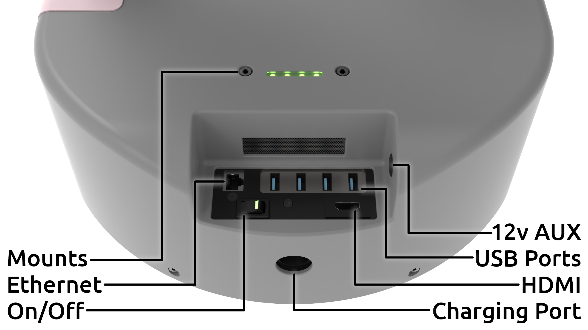
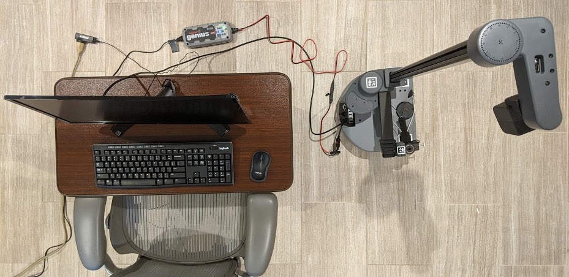
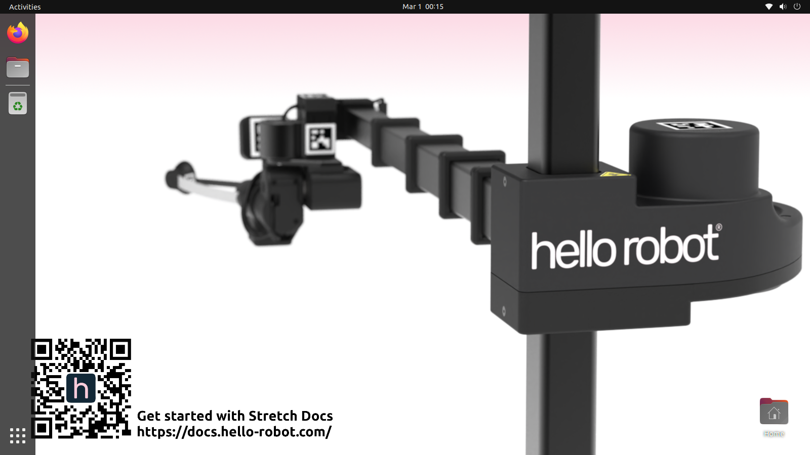
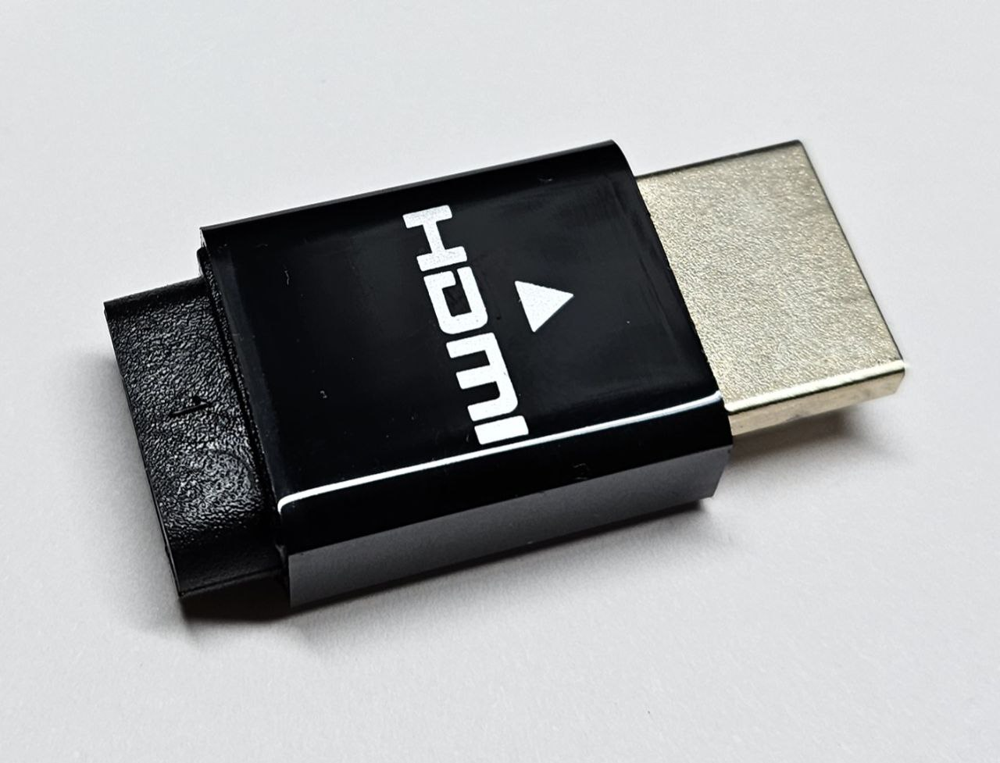
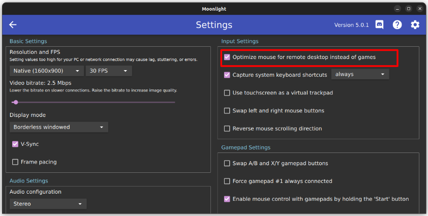
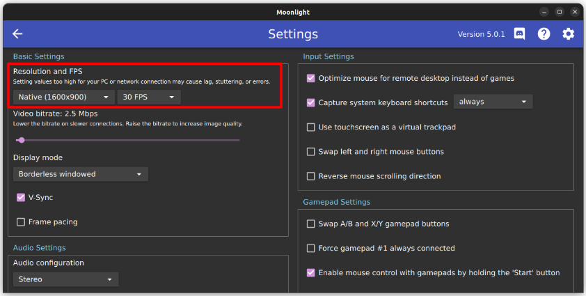
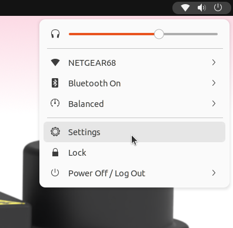
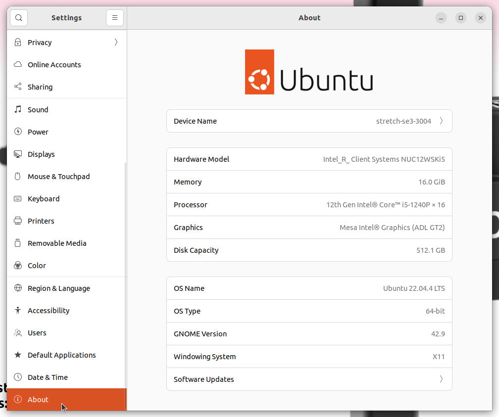
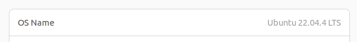
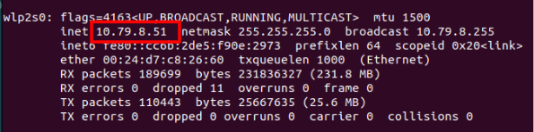

# Connecting to Stretch

In this guide, we will look at two ways of connecting to Stretch, tethered and untethered. Once connected, we'll run the Stretch Visual Servoing demo.

## Tethered Setup

There is a computer inside Stretch called the "Intel NUC". You can develop and test your code directly on this computer.

In the robot's trunk, where the On/Off button is located, you will find several USB ports, a HDMI port, and an ethernet port. All of these are connected directly to the NUC inside the robot. There are additional USB ports located in the robot's head, wrist, and shoulder, which also connect to the NUC. This makes setting up a wired connection to the robot very easy.

{ loading=lazy }

The simplest setup for developing with Stretch is a monitor with an HDMI cable, and a USB keyboard/mouse. At Hello Robot, we prefer to use a wireless keyboard and mouse combo.

{ loading=lazy }

Simply plug the monitor into your robot using the included HDMI cable, and plug your keyboard and mouse into USB ports on the robot. Now turn on the robot again. That's it! After a few seconds, you'll see the NUC boot up sequence on the monitor.

{ loading=lazy }

Next, you'll see the Ubuntu desktop appear on the monitor. You can change your desktop background to a [Stretch-themed wallpaper](./wallpapers.md) if you'd like.

The default user login credentials came in the box with the robot. By default, the robot is not configured to ask for your password on boot, but may ask for it later if the NUC goes to sleep. Stretch is running the Ubuntu 22.04 operating system.

!!! note

    If you're using a Stretch 2 or Stretch RE1, your robot may be running an older operating system. See the [troubleshooting advice](#which-operating-system-is-my-robot-running) below to identify which OS your robot is running.

## Untethered Setup

As a *mobile* manipulator, the robot can only travel so far when tethered by the cables of a monitor, keyboard, and mouse. There are several ways to set up a wireless connection to Stretch, e.g. SSH, VNC, TeamViewer, AnyDesk, and in later tutorials we will explore some of these options and other programmatic methods of networking (e.g. ROS 2 networking, PyZMQ), but in this series we will be using a fast, open-source solution called "Moonlight".

[Moonlight](https://moonlight-stream.org/) is software for streaming video games, but its ability to stream high-resolution, low-latency video makes it ideal for robotic applications as well. To set it up, follow these instructions:

1. You will need a "dummy HDMI dongle". If you're using a Stretch 3, one should be included in the accessories box. Otherwise, they can be found online for low cost.
    - { width="100" loading=lazy }
1. You will need access to the robot's desktop. Go through the [Wired Connection](#wired-connection) section if you haven't already.
1. On the robot, open Wifi settings and connect to a network. If you're using the [Stretch WiFi Access Point](https://hello-robot.com/stretch-access-point), power up the router and Stretch will automatically connect to it.
1. On the robot, open a terminal and run:
    ```{.bash .shell-prompt .copy}
    systemctl start --user sunshine
    ```
1. Then, in the same terminal, run:
    ```{.bash .shell-prompt .copy}
    systemctl enable --user sunshine
    ```
1. Since this is your first time, we'll setup the Moonlight server (called "Sunshine") on Stretch. On the robot, open a browser and visit [https://localhost:47990](https://localhost:47990). You may see a warning and need to click "Advanced..." -> "Continue/Proceed". Next, it will ask you to choose credentials. Make sure to choose secure credentials and share them with anyone else using the robot. Then, log in and navigate to the "PIN" tab.
1. On your laptop or PC, go to [moonlight-stream.org](https://moonlight-stream.org/) and download Moonlight.
1. Ensure your laptop or PC is connected to the same network as Stretch. Moonlight can stream over the internet, but it is configured to work on a local network by default.
1. Open Moonlight. It should automatically detect your Stretch. Click on it and you'll be given a 4 digit PIN. Enter this PIN in the Sunshine PIN page to pair Moonlight with your Stretch. Moonlight will remember this in the future.

    !!! note

        Sometimes Moonlight will not automatically detect the robot, even though both devices are on the same network. If this happens to you, see the [troubleshooting advice](#stretch-isnt-automatically-detected-by-moonlight) below.

1. Moonlight will now show you a page with a button labeled "Desktop". This will start the stream of Stretch's desktop to your laptop or PC. Don't click on it yet. If you already did, exit out using ++ctrl+alt+shift+q++.
1. Locate the dummy HDMI dongle included with Stretch. Disconnect all cables from Stretch, swapping the HDMI cable with the dummy HDMI dongle.
    - { width="100" loading=lazy }
1. You can now click on the "Desktop" app in Moonlight to begin streaming the robot's desktop to your laptop/PC. You now have a wireless connection to Stretch!

To exit out of the stream, press ++ctrl+alt+shift+q++. In the future, you can skip the pairing steps since the devices will already be paired.

### Tips to optimize Moonlight

- If the stream feels laggy, you can reduce the bitrate in Moonlight's settings.
    - { loading=lazy }
- If the mouse feels too fast, you can adjust the mouse behavior for remote desktop in Moonlight's settings.
    - { loading=lazy }
- If part of the Ubuntu desktop is cut off or the resolution is a poor match for your screen, you can adjust the display settings in Moonlight's settings.
    - { loading=lazy }

## Stretch Visual Servoing

If you've reached this point, you're connected to Stretch and ready to roll. Congrats! Let's try the Visual Servoing demo.

{ loading=lazy }

Visual servoing is a powerful way to achieve fast, precise, and robust motions. For this demo, your Stretch robot needs a Dex Wrist 3, which comes with an Intel Realsense D405 depth camera and a gripper with ArUco markers on the fingers.

!!! note

    If you're using a Stretch 2 or Stretch RE1, your robot may not have a Dex Wrist 3. See the [troubleshooting advice](#does-my-robot-have-a-dex-wrist-3) below to identify which tool your robot has.

To start the demo, follow these instructions:

1. Clone this repository on your robot

    ```{.bash .shell-prompt .copy}
    git clone https://github.com/hello-robot/stretch_visual_servoing/
    ```

1. Next, find the transparent acrylic cube that came with your robot. It has a 30 mm by 30 mm ArUco marker on it that encodes the ArUco ID# 202. The robot will try to reach for and grab this cube when it sees the ArUco marker with the D405 camera on its gripper.
1. Home the robot

    ```{.bash .shell-prompt .copy}
    stretch_robot_home.py
    ```

    You may be asked to run `stretch_free_robot_process.py` before homing.

1. Enter into the home directory of the cloned repository

    ```{.bash .shell-prompt .copy}
    cd ./stretch_visual_servoing
    ```

1. Run the visual servoing demo

    ```{.bash .shell-prompt .copy}
    python3 visual_servoing_demo.py
    ```

The Visual Servoing demo also works with a tennis ball. Check out [the instructions](https://github.com/hello-robot/stretch_visual_servoing#tennis-ball-demo) in the repo to try it out.

{ loading=lazy }

{ loading=lazy }

## Next Steps

In the next guide, [Stretch Hardware Overview](./stretch_hardware_overview.md), we will start to get familiar with the robot hardware and some common command line tools.

---

## Troubleshooting

If you're having trouble with the steps in the guide, please check the following tips:

### Which operating system is my robot running?

1. Open system setting by clicking "Settings" in the control panel
    - { loading=lazy }
1. Scroll down the "About" page
    - { loading=lazy }
1. Locate the "OS Name". Stretch has had 3 OS releases: 18.04, 20.04, and 22.04
    - { loading=lazy }

Ubuntu 22.04 is the latest at the time of this writing. The tutorials on this website have been written with 22.04 in mind. If your Stretch is running an older version, consider upgrading using the [Upgrading your Operating System](../../installation/robot_install/) guide.

### Stretch isn't automatically detected by Moonlight

 - Some routers block local networking. You can try adding the robot by entering it's IP address into Moonlight. On the robot, open a terminal and enter `ifconfig`. The output typically looks like this. You can find the robot's IP address by searching for the address near terms like "wlp2s0" and "inet" (e.g. 192.168.1.29 in the image below).
 - { loading=lazy }
 - Some routers block all local networking, so it isn't possible to use Moonlight. If possible, use a different router.

### Does my robot have a Dex Wrist 3?

 - Here's what the Dex Wrist 3 looks like.
    - <div class="iframe-container">
        <iframe class="responsive-iframe" src="https://www.youtube.com/embed/B0Uo5atjqf8" frameborder="0" allowfullscreen></iframe>
      </div>
 - If your robot doesn't have a Dex Wrist 3, you can skip the Visual Servoing section.

------
<div align="center"> All materials are Copyright 2020-2024 by Hello Robot Inc. Hello Robot and Stretch are registered trademarks.</div>
