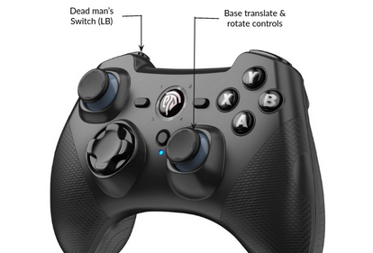

# Demo #1: Mapping and Navigation

Stretch can perceive and navigate through its environment in two different ways: using the onboard 2D lidar with the ROS 2 Navigation Stack, or using the Intel RealSense depth camera with Stretch FUNMAP (Fast Unified Navigation, Mapping, and Planning). The following tutorial will walk you through the basics of launching and using each of these options. 

## Nav2 Overview

The ROS 2 Navigation Stack, or Nav2, is a motion planning and control framework for the mobile base that works right out of the box with Stretch. To use the Nav2 stack, we will first create a map of the local area, using the gamepad teleoperation controller to move the robot around your environment. Once complete, Stretch will be able to localize itself on the map and find its way around the environment autonomously.

### Mapping

To start the mapping demo, open a terminal window and run the following command:

```{.bash .shell-prompt .copy}
ros2 launch stretch_nav2 offline_mapping.launch.py
```

An ROS Visualizer (Rviz) window will open and show the robot and map that is being constructed.


To fill in the map, we need to move the robot through the environment so that the lidar can see the entire area you'd like to map. The gamepad controller will allow you to do this. In this mode, the front left bumper acts as a dead man's switch - keeping this button pressed, drive the robot around the environment using a joystick.



!!! warning

    This mapping method creates a 2D map at the height of the lidar, approximately 6.5" inches above the ground. Later ROS 2 tutorials will cover how to create a 3D map by combining data from the lidar and the head camera.

    Keep in mind that some obstacles in the environment will not be apparent in this 2D map. For example, the robot may only be able to see the legs of a table, which could result in attempting to navigate through the obstacle. The robot also will not be able to see areas that it should not attempt to navigate if no obstacle protrudes above 6.5" - for example, an HVAC vent in the floor, or a downwards staircase. For safety, you should consider constructing temporary barriers to block off these regions while the map is being created.

### Tips for Mapping

 - Keep an eye on the map displayed in Rviz. The dark teal color indicates areas the robot has not seen. Make sure there are no teal 'holes' in the middle of areas you'd like the robot to be able to traverse. 

 - The robot lidar is able to see nearly 360 degree, but has a blind spot created by the robot mast. Make sure to command the robot to rotate every now and then to help fill in the gaps as you navigate around.

 - Floor surfaces that cause Stretch's wheels to slip can result in errors in the map. During this step, try to avoid surfaces like loose rugs, thick-pile carpet, or large thresholds.

### Saving the Map

Once you map captures the space you want Stretch to be able to navigate in, open a **new terminal window** and run the following command to save the map:

```{.bash .shell-prompt .copy}
ros2 run nav2_map_server map_saver_cli -f ${HELLO_FLEET_PATH}/maps/nav2_demo_map
```

This will save two files to the "~/stretch_user/maps" directory - `nav2_demo_map.pgm` and `nav2_demo_map.yaml`.

!!! tip

    `.pgm` files are just images. You can open previously saved map in an image viewer to inspect them. For example, try:

    ```{.bash .shell-prompt .copy}
    eog ${HELLO_FLEET_PATH}/maps/nav2_demo_map.pgm
    ```

### Navigation

Now that we have a saved map of the environment, we can command the robot to move around the mapped space. Run the following command:

```{.bash .shell-prompt .copy}
ros2 launch stretch_nav2 navigation.launch.py map:=${HELLO_FLEET_PATH}/maps/nav2_demo_map.yaml
```

A RViz window should open. At the bottom left of the window, there should be a button labeled "Startup". Press this button, which will launch all navigation related lifecycle nodes. 

Rviz will now attempt to show the robot location on your map; however, it is likely that initially this won't actually match the robot location in real space. To correct for this, click "2D Pose Estimate" from the top bar of the Rviz window, then click on your map in roughly the current location of your robot, and drag in the direction the robot is facing. This gives an initial estimate of the robot's location to the localization package (ACML).

Now let's command the robot to move to another location. Click "2D Nav Goal" in the top bar, then click on the map in another location. In the terminal window, you'll see Nav2 go through the planning phase, and then navigate the robot to the goal. If the planning fails, the robot will being a recovery behavior - rotating in place or backing up.


## FUNMAP Overview

The other option for mapping and navigation with Stretch is to use the FUNMAP package. FUNMAP, which stands for "Fast Unified Navigation, Mapping, and Planning", is a software package built to take advantages of some of the unique elements of Stretch, including the eye-height D435if depth camera in Stretch's head.

To build our map in FUNMAP, first make sure the robot is in a clear area where it can move and rotate the mobile base freely. First run the following command in the terminal:

```{.bash .shell-prompt .copy}
ros2 launch stretch_funmap mapping.launch.py
```

Second, open a new terminal window or tab, and launch the keyboard operation node:

```{.bash .shell-prompt .copy}
ros2 run stretch_core keyboard_teleop --ros-args -p mapping_on:=True
```

Once Rviz has launched, press the spacebar while in the same terminal window to initiate a head scan - commanding the robot to create a map by panning the depth camera around the room, then rotating the mobile base and panning the camera again to overcome the blindspot due to the mast.

At this point, you should see a 3D map resulting from the head scan in RViz. You can click and drag in the window to rotate it around and look at it. It has been created by merging many 3D scans from the head camera.

You can now specify a navigation goal for the robot. If the robot finds a navigation plan to the goal, it will attempt to navigate to it. While navigating, it will use the depth camera to avoid obstacles dynamic obstacles that walk in front of the robot. In RViz, press the "2D Nav Goal" button on the top bar with a magenta arrow icon, then specify a nearby navigation goal pose on the floor of the map by clicking and drawing a magenta arrow. For this to work, the navigation goal must be in a place that the robot can find a path to reach and that the robot has scanned well. For example, the robot will only navigate across floor regions that it has in its map.

If the robot succesfully plans a path, it will display in RViz as green lines connecting white spheres, and the robot will begin moving along this path until it reaches the goal you provided.

Now lets continue building our map. With the robot in this new location, go back to the terminal window and press spacebar again, to initiate a new head scan. The robot will follow the same procedure as before, and data from the new location will be added to the map. In this manner, you can map around obstacles, larger areas, etc. You can continue this process until the entire area of interest is mapped and well-represented in the map.

<!--
#### Reach Planning

Unlike Nav2, FUNMAP also contains a manipulation planner that can move the robot's lift, arm, and wrist. To see the reach planning in action, click on the "Publish Point" button at the top of the Rviz window, then select a point on a surface (tabletop or floor work well) on the map. FUNMAP will attempt to generate a navigation and manipulation plan to reach Stretch's gripper close to the selected 3D location.

GIF

-->

### Saving a Map

FUNMAP maps are top-down images, where the pixel value represents the maximum observed 3D point at that location. Maps are automatically saved when generated - the default location is: 

```
~/stretch_user/debug/merged_maps/
```

You can see the image representations by looking at files with the following naming pattern:

```
~/stretch_user/debug/merged_maps/merged_map_<DATETIME>_mhi_visualization.png
```

## Additional Information

To read more about Nav2, FUNMAP, and mapping and navigation with Stretch, check out the [Choosing your Navigation & Motion Planner](#TODO) guide.

## Next Steps

In the next guide, [Demo #2 - Web Teleop](./demos_web_teleop.md), we will teleoperate the robot from a web browser or mobile phone using Stretch's Web Teleoperation interface.

<!-- TODO:

---

## Troubleshooting

If you're having trouble with the steps in the guide, please check the following tips:

### TODO
 -->

------
<div align="center"> All materials are Copyright 2020-2024 by Hello Robot Inc. Hello Robot and Stretch are registered trademarks.</div>
