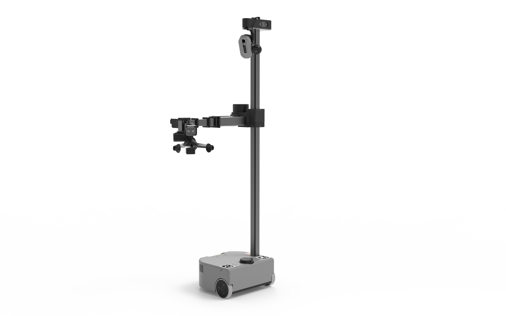
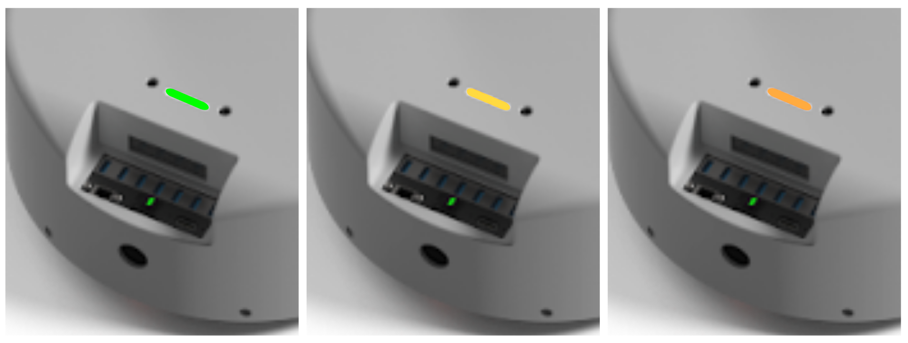
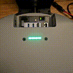
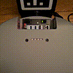
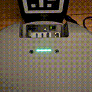
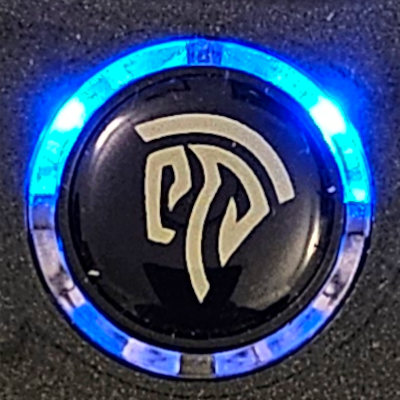
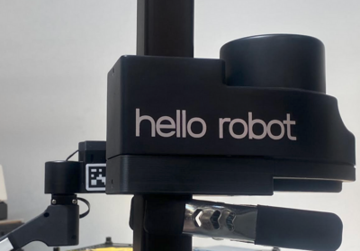
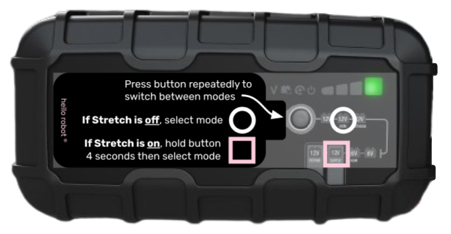
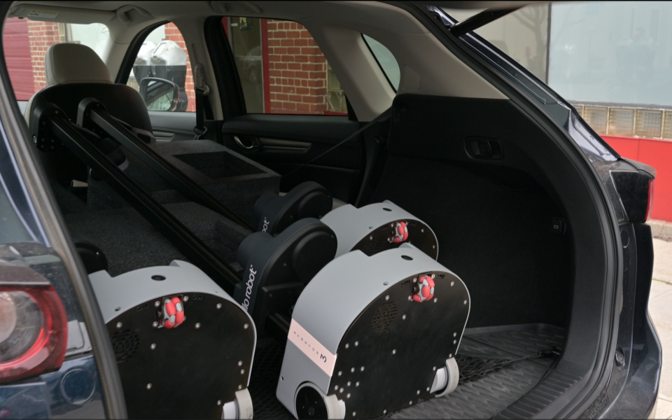
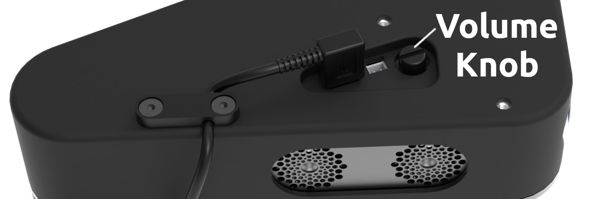

# Hello Robot!

Congratulations on your new robot, and welcome to the community of Stretch developers! This guide is intended to be the starting point for a new user to explore the features and capabilities of the Stretch 3 robot.

## Introducing Stretch

{ loading=lazy }

Meet your new robot! Stretch is a mobile manipulator - a robot consisting of a mobile base as well as an arm and tool, capable of both navigating and interacting with its environment. The design of Stretch is intended to facilitate interactions with people and in human environments. Its compact footprint and slender manipulator have unique advantages for working in cluttered, real-world spaces. The lightweight body and linear joints makes Stretch a friendlier and less complicated robot.

Over the course of these Getting Started tutorials, we will explore the basics of working with Stretch, get familiar with all of its joints and sensors, and run some exciting demonstrations of some of Stretch's more advanced features. In this first tutorial, we'll learn how to turn on the robot and drive it around using the gamepad controller.

## Before You Begin

### Safety

Stretch has the potential to cause harm if not properly used. We recommend that all users review the [Stretch Safety Guide](../../hardware/safety_guide/) before operating the robot.

### Unboxing

If you need assistance unboxing the robot, please refer to the Stretch unboxing video.

  <iframe class="responsive-iframe" src="https://www.youtube.com/embed/O-6VrqqGlig" frameborder="0" allowfullscreen></iframe>

## Powering Up

Before we begin, confirm that all of the packing material has been removed from the robot, and the area around the robot is free and clear from any furniture or obstacles.

To power up the robot, press the On/Off switch found in the base. The LED on the switch should illuminate. The robot may take 20-30 seconds to fully boot, at which point you should hear the [Ubuntu startup sound](images/desktop-login.ogg)[^1] play over the robot speakers.

[^1]:
    The audio asset 'desktop-login.ogg' is provided by the Ubuntu Sounds package
    under the CCPL license. The original license is available at this link:
    [https://git.launchpad.net/ubuntu/+source/ubuntu-sounds/tree/COPYING](https://git.launchpad.net/ubuntu/+source/ubuntu-sounds/tree/COPYING)

{ loading=lazy }

## Safety Features

Before we start operating Stretch, there are two features that are important to understand for the safe use of the robot - the Runstop button and the battery indicator lightbar.

### Runstop Button

The Runstop button is located on the side of the robot's head. Normally, this button will be steadily illuminated white. Pressing this button puts the robot into "runstop"; it interrupts the motion of the robot's primary joints during operation, causing it to stop moving and making all of these joints backdrivable. Just tap it, you'll hear a beep and the button will start flashing. You can now freely move the arm, lift, and wheels of the robot.

  <iframe class="responsive-iframe" src="https://www.youtube.com/embed/nxWDAM117WI" frameborder="0" allowfullscreen></iframe>

This can be useful if the robot makes an unsafe motion, or if you just want to roll the robot around or reposition its arm. To disable runstop, hold the button down for two to three seconds. After the beep, the button will illuminate steadily again and motion can resume.

### Battery Indicator Lightbar

{ loading=lazy }

The battery indicator lightbar in the base provides a simple way to quickly ascertain the robot's battery level. Its color always indicates the battery voltage. Green indicates a fully charged robot, yellow indicates a robot whose charge is starting to decline, and orange-red indicates a robot that should be plugged into its battery charger immediately.

It is important not to run the robot fully out of battery, which will cause the battery capacity to degrade over time, or occasionally lead to more serious electrical damage to the robot. If you notice that your battery indicator starts to look orange or red during this session, please skip ahead to the [Battery Charging Basics](#battery-charging-basics) section of this guide.

The lightbar will also flash as follows to indicate the state of the robot:

| Mode               | Flashing              | Gif                                                 |
| ------------------ | --------------------- | --------------------------------------------------- |
| Normal Operation   | Solid                 | { loading=lazy }   |
| Runstop is active  | Rapid blink at 1 Hz   | { loading=lazy }  |
| Charger plugged in | Slow strobe at 0.5 Hz | { loading=lazy } |

## Gamepad Teleoperation

Stretch comes ready to drive out of the box. Use the included gamepad controller to drive the robot and quickly test out some of its capabilities.

To start the demo:

1. Find the gamepad controller that shipped with Stretch.
1. If you have not already done so, turn the robot on and wait for 20-30 seconds. You will hear the [Ubuntu startup sound](images/desktop-login.ogg)[^1], followed by two beeps (indicating that the demo is running).

    !!! note

        If you don't hear the two beeps, or you are following this guide on a robot that has already been used by someone else, gamepad teleop may not be configured to launch when the robot is booting up. See the [troubleshooting advice](#i-dont-hear-two-beeps-when-the-robot-powers-on) below.

1. Press the center "Connect" button on the controller. The upper two LEDs of the ring will illuminate, indicating that a connection has been made to the USB dongle in the robot's trunk.

    * { width="100" loading=lazy }
    * If the LED ring instead flashes, it needs to be paired with the dongle. Hold the center button for 3-4 seconds until the controller vibrates, and the upper two LEDs illuminates steadily.

1. Make sure the space around the robot is clear. Hit the Home Robot { width="20" .glightbox-skip } button ("Start" on the gamepad). Stretch will begin its homing routine, finding the zero position of all of its joints. Be careful not to interfere with these movements, as it may cause the zero position to be set incorrectly. When this procedure is completed (after ~30 seconds), the robot should beep once.

    !!! note

        If nothing happens when you hit the Start button, see the [troubleshooting advice](#nothing-happens-when-i-try-to-home-the-robot) below.

1. Stretch is now ready to drive! This image shows the mapping between the controller's buttons and the robot's joints:

{ loading=lazy }

Here's a few things to try:

* Hold the Stow Robot { width="30" .glightbox-skip } button for 2 seconds. The robot will assume a stowed pose, with the arm low and the gripper tucked inside the robot's footprint. This position keeps the robot compact and its center of gravity low, so we recommend it when driving the robot base.
* Practice driving the robot around using the Mobile Base { width="30" .glightbox-skip } joystick.
* While driving the mobile base, hold down on the Fast Base { width="30" .glightbox-skip } trigger. When the shoulder is low and the arm fully retracted, Stretch is able to drive at faster speeds safely.
* Practice positioning the arm using the Lift and Arm { width="30" .glightbox-skip } joystick.
* Practice positioning the wrist using the Wrist Yaw { width="30" .glightbox-skip } & { width="30" .glightbox-skip } shoulder buttons, and Wrist Pitch & Roll { width="30" .glightbox-skip } D-Pad.
* Press the { width="30" .glightbox-skip } button to switch the D-pad from Wrist Control to Head Control - now use the { width="30" .glightbox-skip } D-pad to control the Head Pan & Tilt joints of the head camera. Press the { width="30" .glightbox-skip } button again to switch back to wrist control.
* Try grasping an object from the ground or a countertop. Use the { width="30" .glightbox-skip } button to close the gripper. And use the { width="30" .glightbox-skip } button to open the gripper.
* When close to the object, hold down on the Precision Mode { width="30" .glightbox-skip } trigger - this will slow the motion of all of the robot joints, so you can easily line up even a difficult grasp.
* Try delivering an object to a person.
* Try a task that requires you to use two or more of the robot's joints at once, like opening a door or cabinet.
* Try pressing the Runstop button while moving the robot, then reset it by holding the button down for 2 seconds.

## Shutting Down Stretch

Once you're finished with the gamepad teleoperation demo, let's learn how to properly shut down the robot. It is recommended to always wait for the onboard PC to fully shutdown prior to hitting the On/Off switch in the trunk (which will cut off power). From the gamepad teleoperation demo, you can simply hold down the Shutdown PC { width="20" .glightbox-skip } button ("Back" on the gamepad) for 2 seconds. The robot will move to its Stow position, and then the PC will turn off. When the lidar stop spinning, the PC has shutdown.

If you're working with a Stretch 3, turn off the robot with the On/Off switch and the lift joint will slowly descend. If you're working with a Stretch 2 or Stretch RE1, place the included clamp below the shoulder before turning off the On/Off switch because the lift joint will descend rapidly. 

{ loading=lazy }

## Battery Charging Basics

Stretch contains two 12V sealed lead-acid (SLA) batteries. For the health of your robot, is is important to keep Stretch charged and not to let the battery voltage run down too low. It is good practice to plug in Stretch whenever you are not using the robot - the charger will automatically maintain the batteries and keep them topped off and healthy.

Stretch comes with a NOCO Genius10 battery charger with a custom cable. Unbox this charger and set it next to the robot. Plug the charger into the wall, then attach the other end into the robot's charging port.

{ loading=lazy }

Because the robot is now powered **off**, press the Mode button until the **12V AGM** mode is illuminated. This is the recommended mode whenever the robot is turned off.

When the robot is **on**, switch the charger into **Supply** mode as indicated, by holding down and then pressing the Mode button.

## Moving Stretch

Stretch can be transported between different rooms, buildings, or research sites. Here are some suggestions for moving Stretch around more easily:

- Over short distances and on smooth floors, backdriving Stretch is the easiest approach. With the robot powered off, or with the Runstop enabled, the wheels can be backdriven freely. Grab the robot by its mast, tilt it over, and push or pull it to where it needs to go.
- Over longer distances or more difficult terrain, we would recommend the use of a [hand truck](https://en.wikipedia.org/wiki/Hand_truck). For extra protection, place the robot base into the foam block that it was shipped in, and use the truck to move it around securely.
- Stretch can be transported by car. We recommend using the foam blocks from the box Stretch was shipped in when laying the robot down, so the mast is propped up and no weight is on the robot's arm and gripper.
    - { width="500" loading=lazy }
- Flying with Stretch is not typically recommended - the packaged robot is outside of normal weight and dimensional restrictions for checked luggage, and most passenger airlines have specific rules around shipping lead-acid batteries in equipment. It is usually much easier to repackage Stretch in its original packing material and ship it to your destination. Hello Robot can provide a repackaging guide on request.
- Stretch is not waterproof! If transporting it outside, make sure to keep it safe from the elements.

## Next Steps

The next guide in our Getting Started tutorial series, [Connecting to Stretch](./connecting_to_stretch.md), will explain how to connect to the Stretch PC to explore its functions in more detail. We recommend all new users complete the Getting Started series before beginning to develop with the robot.

---

## Troubleshooting

If you're having trouble with the steps in the guide, please check the following tips:

### Stretch never played the Ubuntu startup sound

- The robot may still be booting up, but is delayed due to a software update or some sort of error - wait up to 2 minutes to be sure
- If the audio cue never played, it may just have been disabled in software; or the volume knob in the head may have been turned down all the way. Try continuing with the guide.
    - { width="400" loading=lazy }

### I don't hear two beeps when the robot powers on

- The gamepad controller script might be disabled - this is common on a robot that others have used. You'll need to run `stretch_gamepad_teleop.py` in a Terminal window on the robot. See the next tutorial, [Connecting to Stretch](./connecting_to_stretch.md), for details on how to accomplish this.

### Nothing happens when I try to home the robot

- If the robot has already been homed, pressing the Home Robot { width="20" .glightbox-skip } button won't do anything. Try moving the other controller buttons - if the robot moves then you are already good to go.
- The gamepad controller script might be disabled - this is common on a robot that others have used. You'll need to run `stretch_gamepad_teleop.py` in a Terminal window on the robot. See the next tutorial, [Connecting to Stretch](./connecting_to_stretch.md), for details on how to accomplish this.

### The gamepad connection is intermittent or stops working

- The gamepad connection works best at distances under 30ft, and can be obstructed by walls or large objects - try to have a clear line of sight to the robot.
- If the center button starts flashing, or if no lights illuminate at all, this indicates low controller battery. Plug the controller into a USB port using the included USB-micro cable and leave it to charge for at least 15 minutes, then try again.
- If the controller stops responding, make sure the USB dongle in the robot trunk is still securely attached, and make sure the Runstop function is not enabled (Runstop button and the battery indicator lightbar will flash if runstop is enabled).

### The gamepad button mapping feels incorrect

- Check to see which of the LEDs around the center button are illuminated. In the correct gamepad mode, the top two lights should be on and the bottom two should be off. If you see a different pattern (top-left and bottom-right for instance) then the controller is in the incorrect mode. To resolve this, hold down the center button for at least five seconds, until the LEDs begin flashing. Release the botton and check the LED pattern again. You may need to do this two or three times before the controller returns to the correct mode.
    - The correct mode will have the following pattern:
    - { width="100" loading=lazy }

### My Stretch doesn't have a Battery Indicator Lightbar

- Stretch RE1, the first model of Stretch, does not have an Battery Indicator Lightbar. Instead, you'll need to run `stretch_robot_battery_check.py` in a Terminal window on the robot. See the next tutorial, [Connecting to Stretch](./connecting_to_stretch.md), for details on how to accomplish this.

------

 All materials are Copyright 2020-2024 by Hello Robot Inc. Hello Robot and Stretch are registered trademarks.

