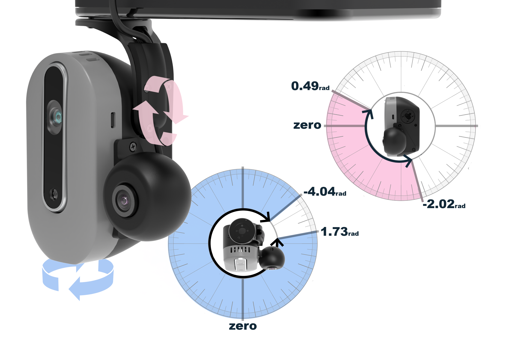
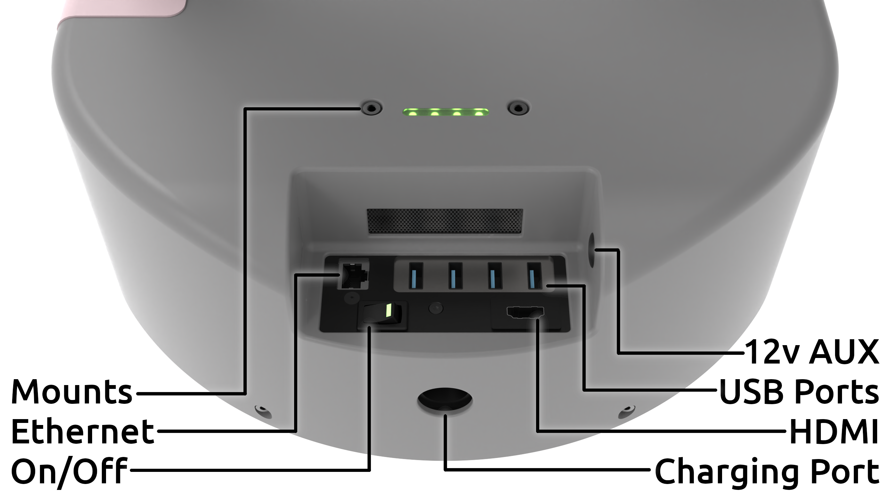

# Stretch Hardware Overview

This guide will walk you through Stretch's hardware from top to bottom, including some simple command line tools you can use to interact with the robot.

To complete this tutorial, you will need a monitor and keyboard/mouse, or a wireless connection to the robot, as discussed in the [previous guide](./connecting_to_stretch.md).

## Powering Up

Turn on Stretch if the robot isn't already powered on. Because the robot is now on, switch the battery charger into "Supply" mode.

{ loading=lazy }

If the NUC goes to sleep, it may ask for a password upon waking up. The default user login credentials came in the box with the robot.

## Turning off Gamepad Teleoperation

Out of the box, Stretch is configured to launch the gamepad teleoperation demo in the background at startup. While this is running, other code cannot use the robot. You will need to free the "robot process" so that your code can use it. Open a Terminal window and input the following:

```{.bash .shell-prompt .copy}
stretch_free_robot_process.py
```

You can also disable the autoboot feature that starts gamepad teleop everytime the robot is booted. Search for 'Startup Applications' from the Apps menu. Uncheck the box for 'hello_robot_gamepad_teleop'.

{ loading=lazy }

## System Check

First, let's check the status of our robot. This is a powerful tool that runs a series of hardware and software checks to confirm that the system is ready for use.

In a Terminal window, run the command:

```{.bash .shell-prompt .copy}
stretch_system_check.py
```

If all checks pass, you know your robot is ready to go.

## Homing

<!-- TODO: { loading=lazy } -->

If your robot needs to be homed, the system check will tell you. The homing procedure is a ~30 second procedure run once every time the robot is powered on, and it will find the zero position of all of Stretch's joints. If you ran the gamepad teleop demo earlier, then you have already seen this homing behavior when starting the demo.

To home the robot, first make sure the robot is in a clear position where the lift, arm, and wrist can move freely without collisions. In a Terminal window, run the command:

```{.bash .shell-prompt .copy}
stretch_robot_home.py
```

The robot will beep when finished. Run a system check one more time - the output should now indicate that all of the motors are homed.

The motors will remember their homing state while the robot remains powered on - using the Runstop, backdriving the robot, or even restarting the PC will not require rehoming.

## Motors and Joints

Next, let's explore the robot hardware, starting with the actuators.

### Stepper Motors

#### Base

{ loading=lazy }

Stretch has a differential-drive base, consisting of two closed-loop stepper motors driving the left and right wheels. The third wheel, located at the back of the robot, is an passive omni wheel that allows motion in any direction.

#### Lift and Arm

{ loading=lazy }

Stretch has a lift degree of freedom that provides vertical translation of the arm. It is driven by a closed-loop stepper motor, providing smooth and precise motion through a low gear-ratio belt drive.

The arm degree of freedom comprises 5 telescoping links set on rollers. Its proprietary drive train is driven by a stepper motor with closed loop control and current sensing, allowing contact sensitivity during motion.

In combination, the lift, arm, and mobile base translation provide three orthogonal axes of motion - in effect, a Cartesian system for end-effector placement.

##### Contact Sensitivity

Stretch's lift and arm joints have a contact detection system that we call Guarded Contact. This safety feature is designed to limit the unwanted forces Stretch could apply to a person or its environment, and can be tuned or configured for your application.

<div class="iframe-container">
  <iframe class="responsive-iframe" src="https://www.youtube.com/embed/MYtmoqT_Bl8" frameborder="0" allowfullscreen></iframe>
</div>

The Guarded Contact behavior uses current sensing to determine if actuator effort exceeds a user-specified threshold during joint motion, and enables the safety controller for the joint until a subsequent movement command is received.

To test this system out, launch the gamepad demo again, this time by running `stretch_gamepad_teleop.py` from the Terminal. Try driving the arm and lift joint, then impeding the motion. After a moderate amount of force, Stretch should halt the motion. When you're done, quit the program by pressing ++ctrl+c++ in the Terminal window.

### Dynamixel Motors

The actuators for the head, wrist, and gripper joints on Stretch are Dynamixel servo motors.

#### Head Camera

<div class="iframe-container">
  <iframe class="responsive-iframe" src="https://www.youtube.com/embed/RulZG3LYdtI" frameborder="0" allowfullscreen></iframe>
</div>

Stretch has a camera module on a pan-tilt mechanism controlled by Dynamixel actuators.

| Axis            | Range  |
| --------------- | ------ |
| Head Pan | 346deg |
| Head Tilt | 115deg |

{ loading=lazy }

#### Dexterous Wrist

<div class="iframe-container">
  <iframe class="responsive-iframe" src="https://www.youtube.com/embed/zTMczTE3TkQ" frameborder="0" allowfullscreen></iframe>
</div>

Stretch has a three degree-of-freedom wrist with yaw, pitch, and roll actuation. All of these joints use Dynamixel actuators.

| Axis        | Range  | Graphic |
| ----------- | ------ | ------- |
| Wrist Yaw   | 340deg | { loading=lazy } |
| Wrist Pitch | 100deg | { loading=lazy } |
| Wrist Roll  | 340deg | { loading=lazy } |

<!-- ##### Collision Prevention

[ basic explanation of the Dex Wrist collision prevention ]

Collision prevention needs additional testing
-->


#### Gripper

<div class="iframe-container">
  <iframe class="responsive-iframe" src="https://www.youtube.com/embed/B0Uo5atjqf8" frameborder="0" allowfullscreen></iframe>
</div>

The compliant gripper is a robust and compliant single-degree-of-freedom tool. A Dynamixel actuator drives the center of the spring mechanism, which causes the outer fingers to flex and provide a grasping force. ArUco tags attached to each finger can be detected by the gripper camera to provide precise fingertip positions.

#### Dynamixel Errors and Reset Tool

While using Stretch, sometimes the Dynamixel motors may end up in an error state. The most common causes of this are over-force errors (usually from attempting to apply a very high force on one joint for more than a couple of seconds) or over-temperature errors (usually from attempting to maintain a high force on one joint for an extended period of time). When a motor encounters this error, it goes into a backdrivable state and stops responding to commands, and the error LED on the motor body blinks red.

Powering down the robot and powering it back on will clear this error (notably, rebooting the robot PC will NOT as it will not disconnect the power). A more convenient way is to run the following command in the terminal:

```{.bash .shell-prompt .copy}
stretch_robot_dynamixel_reboot.py
```

This will reboot all of Stretch's Dynamixel motors, resetting their error status. Doing this will also clear the homing position from the wrist_yaw and gripper joints, so you will want to re-run the `stretch_robot_home.py` script after rebooting the servos.

<!-- TODO:
### Keyboard Teleop

Stretch also comes with a command line tool that allows you to teleoperate the robot's joints from your keyboard. From the command line, you can run:

```{.bash .shell-prompt .copy}
stretch_robot_keyboard_teleop.py
```

and follow the instructions in the menu to control the robot. -->

## Sensors

Stretch includes a number of sensors that allow it to perceive the environment:

- Intel Realsense D435if Active Depth Camera
- Intel Realsense D405 Passive Stereo Depth Camera
- Arducam OV9782 Wide-angle Global Shutter Color Camera
- Slamtec RPLIDAR A1 2D 360deg Lidar
- Respeaker v2.0 Microphone Array
- Bosch BNO085 9-DOF IMU
- Analog ADXL343 Accelerometer
- Sharp GP2Y0A51SK0F Infrared Cliff Sensors

### D435if Depth Camera

An Intel RealSense D435if Depth + RGB Camera is attached to the pan-tilt apparatus in the robot head. With a wide field of view, range up to 10m, active IR projector and global shutter depth sensor, the D435 is an ideal camera for indoor robotics applications. The IF model indicates that the camera has both an internal IMU, and an IR pass filter to improve depth performance.The camera is mounted vertically, so that the robot can see its own body and what is ahead of it simultaneously.

To quickly visualize the RGB and depth streams from this camera, you can run the following command in the Terminal:

```{.bash .shell-prompt .copy}
stretch_realsense_visualizer.py
```

### D405 Depth Camera

Stretch has a second depth camera attached to its gripper - an Intel RealSense D405 Depth Camera. This camera has an ideal range of 7cm to 50cm, perfect for in-hand manipulation tasks.

```{.bash .shell-prompt .copy}
stretch_camera_streams_check.py --d405
```

### Arducam Wide-angle Color Camera

Stretch has a third camera, attached to the same pan-tilt apparatus as the D435if. This smaller camera is an Arducam 1MP RGB camera with a wide-angle lens and global shutter. It is primarily useful when operating the robot remotely, as we will see in an upcoming [Web Interface Demo](./demos_web_interface.md) tutorial.

```{.bash .shell-prompt .copy}
stretch_camera_streams_check.py --navigation
```

### RPLIDAR A1

{ loading=lazy }

On Stretch's mobile base there is a 2D lidar - the Slamtec RPLIDAR A1 model. This lidar has a range of 0.15-12m and an angular resolution of 1deg. The lidar spins when in use, and can be turned on and off programatically.

```{.bash .shell-prompt .copy}
stretch_rp_lidar_jog.py --motor_on
```

In an upcoming [Mapping & Navigation Demo](./demos_mapping_and_navigation.md) tutorial, we will learn how to map an area and navigate through it autonomously using the lidar.

### ReSpeaker Microphone Array

{ loading=lazy }

On the top of the robot head, there is a ReSpeaker v2.0 Microphone Array, a far-field array of four microphones capable of detecting voices up to 5m away. The 12 RGB LEDs in the light ring are programmable. By default, a simple audio localization algorithm illuminates the LEDs when noise is made near the robot and highlights the single LED closest to the direction of sound.

```{.bash .shell-prompt .copy}
stretch_respeaker_test.py
```

### Speakers

{ loading=lazy }

Also on the robot head are a pair of stereo speakers for audio output. On the top of the head, next to the USB port, is a rotary knob that you can turn to adjust the volume.

{ loading=lazy }

To quickly test the speaker output, run the following command:

```{.bash .shell-prompt .copy}
stretch_audio_test.py
```

### Base IMU

The mobile base has a 9-DoF IMU using the Bosch BNO085 chipset. This is the same chipset used on the [Adafruit IMU fusion board](https://www.adafruit.com/product/4754).

{ loading=lazy }

The IMU combines an accelerometer with a gyroscope and magnetometer, to measure the robot base's velocity, orientation, and rotation with respect to gravity.

```{.bash .shell-prompt .copy}
stretch_pimu_scope.py --gx
```

### Wrist Accelerometer

The wrist includes a 3 axis accelerometer using the Analog [ADXL343](https://www.analog.com/media/en/technical-documentation/data-sheets/ADXL343.pdf) chipset which provides bump and tap detection capabilities. The sensor is mounted inside the distal link of the arm.

```{.bash .shell-prompt .copy}
stretch_wacc_scope.py --ax
```

### Cliff Sensors

Stretch has four Sharp GP2Y0A51SK0F IR cliff sensors pointed toward the floor. These report the distance to the floor, allowing for the detection of thresholds, stair edges, etc.

While these sensors are calibrated at the Hello Robot factory, their readings are highly dependent on the type of floor surface where Stretch is being used. These sensors can be calibrated to the robot's new environment.

Because using these sensors to detect hazardous terrain relies on several external factors (e.g. floor surface, velocity of the robot, type of obstacle) and can be risky for the robot and those around it, cliff detection is disabled by default.

```{.bash .shell-prompt .copy}
stretch_pimu_scope.py --cliff
```

## Developer I/O

Stretch contains several additional ports connected to the onboard PC that can be used for additional hardware or accessories:

 - In the trunk, there are 4 USB-A 3.2 ports, an Ethernet port, and an HDMI port. If needed, battery (12V @ 5A) power can also be accessed from inside the robot base by removing the rubber plug in the side of the trunk.
    - { width="500" loading=lazy }

 - In the shoulder, there is a USB-A 2.0 port and battery (12V @ 3A) power.
    - { width="500" loading=lazy }

 - At the end-of-arm, there is a USB-A 2.0 port (typically used by the gripper camera), as well as an Arduino that can be accessed through a 10-pin JST header (12V @ 500mA, SPI, I2C, and digital IO).
    - { width="500" loading=lazy }

 - On top of the head, there is a USB-A 2.0 port (typically used by the RGB camera), as well as battery (12V @ 3A) power.
    - { width="500" loading=lazy }

 - At the wrist, there's a quick-connect mechanism, as well as a Dynamixel X-Series TTL chain. The Extending Stretch tutorials contain information on designing your own tool for the quick-connect mechanism.
    - <div class="iframe-container">
        <iframe class="responsive-iframe" src="https://www.youtube.com/embed/nBN2-0xlI84" frameborder="0" allowfullscreen></iframe>
      </div>

 - And there's threaded mounting points on the base, shoulder, head, and wrist.

<!-- TODO:
## Compute

TODO

 - NUC 12 w/ Ubuntu 22.04, 32gb RAM & 500GB SSD
 - Jetson backpack if necessary
 - GPU networking -->

## Next Steps

In the next tutorial, [Writing Code](./writing_code.md), we will write a simple Python program to actuate all of the different joints of the robot.

<!-- TODO:

---

## Troubleshooting

TODO -->

------
<div align="center"> All materials are Copyright 2020-2024 by Hello Robot Inc. Hello Robot and Stretch are registered trademarks.</div>
