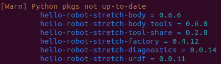

# Keeping your Software Up-to-date

Your Stretch receives a few different kinds of software updates, each with its own procedure for applying the update. This guide covers a strategy for keeping your Stretch's software up-to-date. First, here are the kinds of updates you can expect:

 * **SDK-level updates:** The ROS and Python libraries that constitute Stretch's software development kit (SDK) receive frequent updates. Using the latest SDK ensures access to the latest features and bug-fixes.
 * **Operating System-level updates:** The onboard computer runs an operating system (typically [Ubuntu](https://en.wikipedia.org/wiki/Ubuntu)). The OS bundled with the Stretch SDK is called a 'Robot Distribution'. A list of the available distributions is in the [Distributions & Roadmap](./distributions.md) guide. Using the recommended distribution ensures that you receive SDK-level updates.
 * **Firmware-level updates:** While the onboard computer inside Stretch receives SDK and OS-level updates, the microcontrollers powering Stretch's motors and sensors receive firmware-level updates. Using the latest firmware ensures correctness and performance from Stretch's hardware controllers.

## Identifying your current software

The system check tool can print out a summary of your current software:

```{.bash .shell-prompt .copy}
stretch_system_check.py -v
```

At the bottom of the output, you might see a "Checking Software" section (if this doesn't appear, [see below](#manually-identifying-your-current-software)):

<figure markdown>
  
  <figcaption>This output tells us that this Stretch is running the Ubuntu 22.04 distribution, with firmware v0.5.1p3, varying versions of Stretch's Python packages, and ROS2 Humble. </figcaption>
</figure>

??? warning "If the 'Checking Software' section doesn't appear"

    It's likely because you're using an older version of the tool. Follow these instructions to collect the same information. You can ask for help on [the forum](https://forum.hello-robot.com/) if you run into any issues.

    #### Manually identifying your current software

    Run the following command to identify the operating system you're running:
    ```{.bash .shell-prompt .copy}
    lsb_release -d
    ```
    The output will report your OS:
    ```
    Description:	Ubuntu 22.04.3 LTS
    ```
    The list of supported/deprecated distributions is [available here](./distributions.md).

    Next, run the following command to identify your firmware:
    ```{.bash .shell-prompt .copy}
    REx_firmware_updater.py --recommended
    ```
    The output will report your current firmware and recommended action:
    ```
    Collecting information...
    Collecting information...
    Collecting information........

    ######################################## Recommended Firmware Updates ########################################


    DEVICE                    | INSTALLED                 | RECOMMENDED               | ACTION                    
    --------------------------------------------------------------------------------------------------------------
    HELLO-MOTOR-ARM           | Stepper.v0.5.1p3          | Stepper.v0.6.2p4          | Upgrade recommended       
    HELLO-MOTOR-RIGHT-WHEEL   | Stepper.v0.5.1p3          | Stepper.v0.6.2p4          | Upgrade recommended       
    HELLO-MOTOR-LEFT-WHEEL    | Stepper.v0.5.1p3          | Stepper.v0.6.2p4          | Upgrade recommended       
    HELLO-PIMU                | Pimu.v0.5.1p3             | Pimu.v0.6.1p4             | Upgrade recommended       
    HELLO-WACC                | Wacc.v0.5.1p3             | Wacc.v0.5.1p3             | At most recent version    
    HELLO-MOTOR-LIFT          | Stepper.v0.5.1p3          | Stepper.v0.6.2p4          | Upgrade recommended       

    Run recommended command: 
    REx_firmware_updater.py --install  --arm --right_wheel --left_wheel --pimu --lift
    ```

    Next, run the following command to identify which versions of the Python libraries you have:
    ```{.bash .shell-prompt .copy}
    pip3 list | grep hello
    ```
    The output will report your Python libraries:
    ```
    hello-robot@stretch-re2-2002:~$ pip3 list | grep hello
    hello-helpers                          0.2.0
    hello-robot-stretch-body               0.6.6
    hello-robot-stretch-body-tools         0.6.0
    hello-robot-stretch-diagnostics        0.0.14
    hello-robot-stretch-factory            0.4.12
    hello-robot-stretch-tool-share         0.2.8
    hello-robot-stretch-urdf               0.0.11
    ```
    You can see what the latest version of these libraries are by visiting [https://pypi.org/project/hello-robot-stretch-body/](https://pypi.org/project/hello-robot-stretch-body/) and replacing the library name in the URL.

    Next, run the following command to see if ROS is enabled:
    ```{.bash .shell-prompt .copy}
    echo $ROS_DISTRO
    ```
    If the output is empty, no version of ROS has been [sourced in your bashrc](https://wiki.ros.org/ROS/Tutorials/InstallingandConfiguringROSEnvironment#Managing_Your_Environment). Otherwise, the output indicates which version of ROS is enabled:
    ```
    humble
    ```

    Next, if ROS is enabled, run the following command to identify your Stretch ROS branch and latest commit:
    ```{.bash .shell-prompt .copy}
    cd ~/<workspace_dir>/src/<stretch_ros_version> && git branch && git show HEAD --stat
    # replace <workspace_dir> with 'ament_ws' if using ROS2 or 'catkin_ws' if using ROS1
    # replace <stretch_ros_version> with 'stretch_ros2' if using ROS2 or 'stretch_ros' if using ROS1
    ```
    The output will report your Stretch ROS branch (`* humble` below) amd latest commit (`99cda32feec0cf67e9b13cc862b4f293dd678c1e` below):
    ```
    * humble
    commit 99cda32feec0cf67e9b13cc862b4f293dd678c1e (HEAD -> humble, origin/humble, origin/HEAD)
    Author: Binit Shah <bshah@hello-robot.com>
    Date:   Sun Nov 19 21:46:39 2023 -0500

        Update export_urdf.sh

    stretch_description/urdf/export_urdf.sh | 23 +++++++++++++----------
    1 file changed, 13 insertions(+), 10 deletions(-)
    ```
    You can see the main branch and its latest commit by visiting the Github page for either [Stretch ROS](https://github.com/hello-robot/stretch_ros) or [Stretch ROS2](https://github.com/hello-robot/stretch_ros2).

    With the information collected here, you'll be able to follow the rest of this tutorial.

---

## Updating Software

### Robot Distribution

| Output  | Recommendation  |
|---|---|
|  | If your Stretch is running a [supported distribution](./distributions.md#list-of-distributions), you can skip to the next section. |
|  | If your Stretch is running a [deprecated distribution](./distributions.md#deprecated-distributions), it's a good idea to perform the upgrade now. This will update your SDK and firmware as well. Check out the [Upgrading your Operating System](../../installation/robot_install/) guide. |
| { width="1050" } | If your code relies on software that has not yet been ported to a newer distribution or if you're in the middle of a project, you may want to hold off on upgrading. If you're starting a new project, it's a good idea to upgrade and build on the latest distribution. Check out the [Upgrading your Operating System](../../installation/robot_install/) guide. |

### Python Libraries



If you see a warning that your Python pkgs are out-of-date, you can run the following command for each package name.
```{.bash .shell-prompt .copy}
pip3 install -U hello-robot-stretch-<pkg_name>
```

### ROS Workspace


If you see a warning that your ROS workspace is out-of-date, you can create a new workspace to replace it. Check out the [Updating your ROS Workspace](../../installation/ros_workspace/) guide.

### Firmware


If you see a warning that your firmware is out-of-date, you can run the following command.
```{.bash .shell-prompt .copy}
REx_firmware_updater.py --install
```

---

## Troubleshooting

### Param Migration Error

If you see the following error:

```
Please run tool REx_migrate_params.py before continuing. For more details, see https://forum.hello-robot.com/t/425
```

This error appears because the organization of Stretch's parameters has changed since Stretch Body v0.3 and requires a migration of these parameters to the new organization system. Executing the following command will automaticaly migrate your parameters over:

```{.bash .shell-prompt .copy}
REx_migrate_params.py
```

### Firmware Mismatch Error

If you see the following error:

```
----------------
Firmware protocol mismatch on /dev/XXXX.
Protocol on board is pX.
Valid protocol is: pX.
Disabling device.
Please upgrade the firmware and/or version of Stretch Body.
----------------
```

This error appears because the low level Python SDK, Stretch Body, and the firmware cannot communicate to each other. There is a protocol mismatch preventing communication between the two. Simply upgrade Stretch Body using the [instructions above](#python-libraries).
